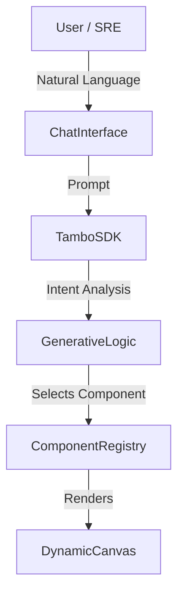

# SRE-0 | Generative Operations Interface


> **"Interfaces should be assembled at runtime, not pre-designed at build time."**

**SRE-0** ("SRE Zero") is a next-generation incident response interface that eliminates dashboard fatigue. Instead of navigating through hundreds of static Grafana boards during a crisis, SRE-0 uses **Generative UI** to construct the exact operational tools you need, the moment you need them.

Built for the **Tambo "The UI Strikes Back" Hackathon** (Feb 2026).

---

## ⚡ The Problem

Modern SRE workflows are broken by static tooling:
*   **Context Switching:** Engineers waste critical minutes jumping between logs, metrics, and runbooks.
*   **Cognitive Overload:** Dashboards show *everything*, burying the signal in the noise.
*   **Rigidity:** Static UIs cannot adapt to the unique, evolving nature of a production incident.

## 🛡️ The Solution

SRE-0 replaces the dashboard with an **Intent-Based Canvas**.
1.  **You speak:** "Production is slow."
2.  **AI interprets:** Understands you need performance metrics.
3.  **UI generates:** Instantly renders a live latency graph.

As the incident evolves ("Check the logs", "Fix it"), the interface shapeshifts to provide the exact tool required for the next step.

---

## 🚀 Key Features (The "God Components")

SRE-0 creates a polymorphic interface using three core generative components:

### 1. MetricVisualizer
*   **Purpose:** Real-time health monitoring.
*   **Behavior:** dynamically renders area charts with gradient fills. Visualizes "Critical" states with jagged, red patterns and "Stable" states with smooth, green curves.

### 2. LogStream
*   **Purpose:** Deep-dive debugging.
*   **Behavior:** A terminal-style log viewer that auto-scrolls to errors. It parses log levels (INFO, WARN, ERROR) and applies semantic highlighting for instant readability.

### 3. ControlDeck
*   **Purpose:** Remediation and action.
*   **Behavior:** A high-risk action panel. Provides situational buttons (Restart, Rollback, Scale) with built-in safety delays and optimistic UI feedback.

---

## 🛠️ Tech Stack

*   **Framework:** [Next.js 14](https://nextjs.org/) (App Router)
*   **Generative SDK:** [Tambo](https://tambo.co/) (@tambo-ai/react)
*   **Styling:** [Tailwind CSS](https://tailwindcss.com/)
*   **Visualization:** [Recharts](https://recharts.org/)
*   **Animations:** [Framer Motion](https://www.framer.com/motion/)
*   **Icons:** [Lucide React](https://lucide.dev/)

---

## 🏁 Getting Started

### Prerequisites
*   Node.js 18+
*   A Tambo AI API Key (Get one at [tambo.co](https://tambo.co))

### Installation

1.  **Clone the repository**
    ```bash
    git clone https://github.com/t6harsh/tambo.git
    cd tambo/sre-0
    ```

2.  **Install dependencies**
    ```bash
    npm install
    ```

3.  **Configure Environment**
    Create a `.env.local` file in the root directory:
    ```bash
    NEXT_PUBLIC_TAMBO_API_KEY=your_tambo_api_key_here
    ```

4.  **Run Development Server**
    ```bash
    npm run dev
    ```

Open [http://localhost:3000](http://localhost:3000) to see the app.

---

## 🎬 Demo Scenario

To see the full power of SRE-0, follow this script in the chat interface:

1.  **Discovery:** *"Production seems slow right now."*
    *   *Result:* SRE-0 renders a **Critical MetricVisualizer** showing high latency.
2.  **Diagnosis:** *"Check the logs for the payment service."*
    *   *Result:* interface swaps to the **LogStream**, highlighting connection errors.
3.  **Remediation:** *"That looks bad. Give me options to fix it."*
    *   *Result:* **ControlDeck** appears with "Restart" and "Rollback" options.
4.  **Resolution:** *Click "Restart Container"*
    *   *Result:* Action executes, and the system confirms stability.

---

## 🏗️ Architecture



---

## 📄 License

This project is open source and available under the [MIT License](LICENSE).

---

<div align="center">
  <sub>Built with ❤️ by Harsh using Tambo SDK</sub>
</div>
